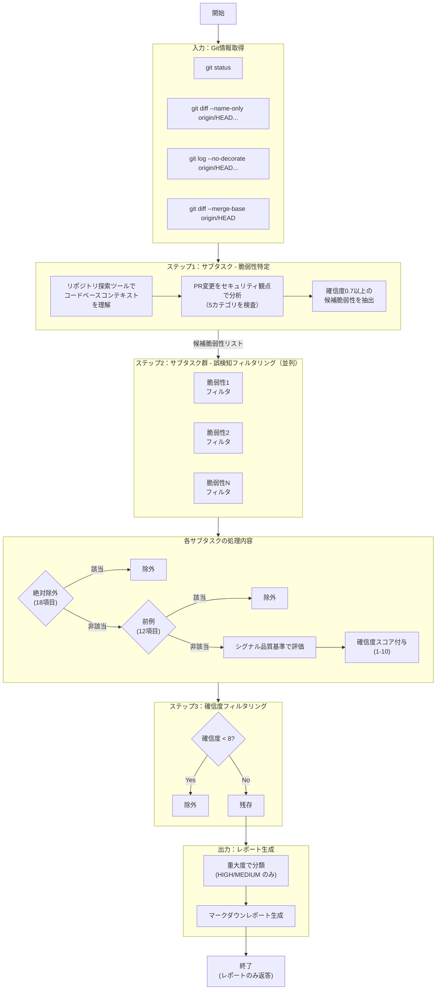

## この記事について

| 項目 | 内容 |
|---|---|
| **対象読者** | Claude Codeを使っている開発者、LLMを業務ツールに組み込みたいエンジニア |
| **得られること** | `/security-review` の設計を理解し、自分のLLMツールに応用できるようになる |
| **前提知識** | PRレビューの経験があれば十分。セキュリティの専門知識は不要 |

---

## /security-review とは

Anthropic が公開した `/security-review` は、Claude Code の**スラッシュコマンド**だ。
ただし本質は「脆弱性をたくさん見つける機能」ではない。
**PRレビューで使える出力に絞り込むための制約設計**にある。

---

## プロンプト全文（日本語訳）

以下は `/security-review` のプロンプト全文（日本語訳）だ。

:::details プロンプト全文（クリックで展開）

あなたはシニアセキュリティエンジニアとして、このブランチの変更に対する集中的なセキュリティレビューを実施します。

**Gitステータス：**

```
!`git status`
```

**変更されたファイル：**

```
!`git diff --name-only origin/HEAD...`
```

**コミット：**

```
!`git log --no-decorate origin/HEAD...`
```

**差分内容：**

```
!`git diff --merge-base origin/HEAD`
```

上記の完全な差分をレビューすること。これにはPR内のすべてのコード変更が含まれている。

---

**目的：**
実際の悪用可能性を持つ**高確信度**のセキュリティ脆弱性を特定するための、セキュリティに焦点を当てたコードレビューを実行します。これは一般的なコードレビューではありません。このPRで**新たに追加された**セキュリティへの影響のみに焦点を当ててください。既存のセキュリティ上の懸念についてはコメントしないでください。

**重要な指示：**

1. **誤検知を最小化する**：実際の悪用可能性について80%以上確信がある問題のみを報告する
2. **ノイズを避ける**：理論的な問題、スタイル上の懸念、影響の小さい発見はスキップする
3. **影響に焦点を当てる**：不正アクセス、データ漏洩、またはシステム侵害につながる可能性のある脆弱性を優先する
4. **除外事項**：以下の種類の問題は報告しないこと：
   - サービス停止を可能にするDoS（サービス拒否）脆弱性
   - ディスクに保存されたシークレットや機密データ（これらは他のプロセスで処理される）
   - レート制限やリソース枯渇の問題

---

### 検査すべきセキュリティカテゴリ

**入力検証の脆弱性：**
- サニタイズされていないユーザー入力によるSQLインジェクション
- システムコールまたはサブプロセスでのコマンドインジェクション
- XMLパースにおけるXXEインジェクション
- テンプレートエンジンにおけるテンプレートインジェクション
- データベースクエリにおけるNoSQLインジェクション
- ファイル操作におけるパストラバーサル

**認証・認可の問題：**
- 認証バイパスのロジック
- 権限昇格の経路
- セッション管理の欠陥
- JWTトークンの脆弱性
- 認可ロジックのバイパス

**暗号とシークレット管理：**
- ハードコードされたAPIキー、パスワード、またはトークン
- 弱い暗号アルゴリズムまたは実装
- 不適切な鍵の保存または管理
- 暗号学的乱数の問題
- 証明書検証のバイパス

**インジェクションとコード実行：**
- デシリアライゼーションによるリモートコード実行
- PythonにおけるPickleインジェクション
- YAMLデシリアライゼーションの脆弱性
- 動的コード実行におけるEvalインジェクション
- Webアプリケーションにおけるxss脆弱性（反射型、格納型、DOMベース）

**データ漏洩：**
- 機密データのログ出力または保存
- PII（個人識別情報）の取り扱い違反
- APIエンドポイントのデータ漏洩
- デバッグ情報の露出

補足：
- ローカルネットワークからのみ悪用可能な場合でも、HIGH重大度の問題となり得る

---

### 分析手法

**フェーズ1 - リポジトリコンテキストの調査（ファイル検索ツールを使用）：**
- 使用されている既存のセキュリティフレームワークとライブラリを特定
- コードベースで確立されたセキュアコーディングパターンを探す
- 既存のサニタイズと検証パターンを調べる
- プロジェクトのセキュリティモデルと脅威モデルを理解する

**フェーズ2 - 比較分析：**
- 新しいコード変更を既存のセキュリティパターンと比較する
- 確立されたセキュアプラクティスからの逸脱を特定する
- 一貫性のないセキュリティ実装を探す
- 新しい攻撃面を導入するコードにフラグを立てる

**フェーズ3 - 脆弱性評価：**
- 変更された各ファイルのセキュリティへの影響を検査する
- ユーザー入力から機密操作へのデータフローをトレースする
- 安全でない形で越えられている権限境界を探す
- インジェクションポイントと安全でないデシリアライゼーションを特定する

---

### 必須出力フォーマット

発見事項はマークダウンで出力すること。マークダウン出力には、ファイル、行番号、重大度、カテゴリ（例：`sql_injection`や`xss`）、説明、悪用シナリオ、修正推奨を含めること。

例：

```
# 脆弱性 1: XSS: `foo.py:42`

- 重大度: High
- 説明: `username`パラメータからのユーザー入力がエスケープなしで直接HTMLに補間されており、反射型XSS攻撃を許可している
- 悪用シナリオ: 攻撃者が/bar?q=<script>alert(document.cookie)</script>のようなURLを作成し、被害者のブラウザでJavaScriptを実行させ、セッションハイジャックやデータ窃取を可能にする
- 推奨: すべてのユーザー入力をHTMLにレンダリングする際に、Flaskのescape()関数または自動エスケープが有効なJinja2テンプレートを使用する
```

---

### 重大度ガイドライン

- **HIGH**: RCE、データ漏洩、または認証バイパスにつながる直接悪用可能な脆弱性
- **MEDIUM**: 特定の条件を必要とするが、重大な影響を持つ脆弱性
- **LOW**: 多層防御の問題、または影響の小さい脆弱性

---

### 確信度スコアリング

- 0.9-1.0: 確実な悪用経路が特定され、可能であればテスト済み
- 0.8-0.9: 既知の悪用方法を持つ明確な脆弱性パターン
- 0.7-0.8: 悪用に特定の条件を必要とする疑わしいパターン
- 0.7未満: 報告しない（推測的すぎる）

---

### 最終確認

HIGHとMEDIUMの発見のみに焦点を当てること。理論的な問題を見逃すよりも、誤検知でレポートを埋め尽くさないことが重要。各発見は、セキュリティエンジニアがPRレビューで自信を持って指摘するものであるべき。

---

### 誤検知フィルタリング

> コマンドを実行して脆弱性を再現する必要はない。コードを読んで実際の脆弱性かどうかを判断すること。bashツールを使用したり、ファイルに書き込んだりしないこと。

**絶対除外 - 以下のパターンに一致する発見は自動的に除外：**

1. DoS（サービス拒否）脆弱性またはリソース枯渇攻撃
2. 適切に保護されているディスク上のシークレットまたは認証情報
3. レート制限の懸念またはサービス過負荷シナリオ
4. メモリ消費またはCPU枯渇の問題
5. セキュリティ上重要でないフィールドの入力検証不足（証明されたセキュリティ影響がない場合）
6. 信頼できない入力で明確にトリガー可能でない限り、GitHub Actionワークフローの入力サニタイズの懸念
7. 強化対策の欠如。コードがすべてのセキュリティベストプラクティスを実装することは期待されない。具体的な脆弱性のみをフラグ付けする
8. 実際的というより理論的な競合状態やタイミング攻撃。競合状態が具体的に問題がある場合のみ報告する
9. 古いサードパーティライブラリに関連する脆弱性。これらは別途管理され、ここで報告すべきではない
10. Rustではバッファオーバーフローやuse-after-freeなどのメモリ安全性の問題は不可能。Rustやその他のメモリ安全言語でメモリ安全性の問題を報告しない
11. ユニットテストのみ、またはテスト実行の一部としてのみ使用されるファイル
12. ログスプーフィングの懸念。サニタイズされていないユーザー入力をログに出力することは脆弱性ではない
13. パスのみを制御するSSRF脆弱性。SSRFはホストまたはプロトコルを制御できる場合のみ懸念事項
14. AIシステムプロンプトにユーザー制御コンテンツを含めることは脆弱性ではない
15. 正規表現インジェクション。信頼できないコンテンツを正規表現に注入することは脆弱性ではない
16. 正規表現DoSの懸念
17. 安全でないドキュメント。マークダウンファイルなどのドキュメントファイルの発見を報告しない
18. 監査ログの欠如は脆弱性ではない

**前例：**

1. 高価値のシークレットを平文でログ出力することは脆弱性。URLのログ出力は安全と見なす
2. UUIDは推測不可能と見なすことができ、検証は不要
3. 環境変数とCLIフラグは信頼された値。攻撃者は通常、安全な環境でこれらを変更できない。環境変数の制御に依存する攻撃は無効
4. メモリやファイルディスクリプタのリークなどのリソース管理の問題は無効
5. タブナビング、XS-Leaks、プロトタイプ汚染、オープンリダイレクトなどの微妙または影響の小さいWeb脆弱性は、非常に高確信度でない限り報告しない
6. ReactとAngularは一般的にXSSに対して安全。これらのフレームワークは、dangerouslySetInnerHTML、bypassSecurityTrustHtml、または同様のメソッドを使用していない限り、ユーザー入力をサニタイズまたはエスケープする必要はない。安全でないメソッドを使用していない限り、ReactまたはAngularコンポーネントやtsxファイルのXSS脆弱性を報告しない
7. GitHub Actionワークフローのほとんどの脆弱性は実際には悪用できない。GitHub Actionワークフローの脆弱性を検証する前に、それが具体的で非常に特定の攻撃経路を持つことを確認する
8. クライアントサイドのJS/TSコードの権限チェックや認証の欠如は脆弱性ではない。クライアントサイドのコードは信頼されておらず、これらのチェックを実装する必要はなく、サーバーサイドで処理される。バックエンドに信頼できないデータを送信するすべてのフローにも同様に適用され、バックエンドがすべての入力を検証およびサニタイズする責任を負う
9. MEDIUMの発見は、明白で具体的な問題である場合のみ含める
10. Jupyterノートブック（*.ipynbファイル）のほとんどの脆弱性は実際には悪用できない。ノートブックの脆弱性を検証する前に、それが具体的で、信頼できない入力が脆弱性をトリガーできる非常に特定の攻撃経路を持つことを確認する
11. 非PIIデータのログ出力は、データが機密である可能性があっても脆弱性ではない。シークレット、パスワード、または個人識別情報（PII）などの機密情報を露出する場合のみ、ログ出力の脆弱性を報告する
12. シェルスクリプトのコマンドインジェクション脆弱性は、シェルスクリプトが通常信頼できないユーザー入力で実行されないため、実際には悪用できないことが一般的。シェルスクリプトのコマンドインジェクション脆弱性は、具体的で信頼できない入力の非常に特定の攻撃経路がある場合のみ報告する

---

### シグナル品質基準 - 残りの発見について評価：

1. 明確な攻撃経路を持つ具体的で悪用可能な脆弱性があるか？
2. これは理論的なベストプラクティスではなく、実際のセキュリティリスクを表しているか？
3. 特定のコード位置と再現手順があるか？
4. この発見はセキュリティチームにとって実行可能か？

各発見に1-10の確信度スコアを割り当てる：
- 1-3: 低確信度、おそらく誤検知またはノイズ
- 4-6: 中確信度、調査が必要
- 7-10: 高確信度、おそらく真の脆弱性

---

### 分析開始

今すぐ分析を開始すること。これを3つのステップで行う：

1. サブタスクを使用して脆弱性を特定する。リポジトリ探索ツールを使用してコードベースのコンテキストを理解し、次にPRの変更をセキュリティの観点から分析する。このサブタスクのプロンプトには、上記のすべてを含める。
2. 上記のサブタスクで特定された各脆弱性について、誤検知をフィルタリングするための新しいサブタスクを作成する。これらのサブタスクは並列サブタスクとして起動する。これらのサブタスクのプロンプトには、「誤検知フィルタリング」の指示のすべてを含める。
3. サブタスクが確信度8未満と報告した脆弱性をフィルタリングで除外する。

最終的な返答にはマークダウンレポートのみを含め、それ以外は含めないこと。

:::

---

## 処理フロー

プロンプトの「分析開始」で指示された **3ステップ** に基づく。

### 処理一覧

| フェーズ | 何をするか | 目的 |
|---|---|---|
| **入力** | Git情報取得（4種） | レビュー対象の差分を機械的に確定 |
| **ステップ1** | サブタスク：脆弱性特定 | リポジトリコンテキストを理解し、候補を抽出 |
| **ステップ2** | サブタスク群：誤検知フィルタリング（並列） | 各候補を絶対除外・前例でふるい分け |
| **ステップ3** | 確信度フィルタリング | 確信度8未満を除外 |
| **出力** | レポート生成 | HIGH/MEDIUMのみをマークダウンで出力 |

### フローチャート



### 入力：Git情報取得

プロンプト冒頭で4つのGitコマンドが実行され、レビュー対象が自動的に決まる。

| コマンド | 取得する情報 |
|---|---|
| `git status` | 作業ツリーの状態 |
| `git diff --name-only origin/HEAD...` | 変更されたファイル一覧 |
| `git log --no-decorate origin/HEAD...` | コミット履歴 |
| `git diff --merge-base origin/HEAD` | 差分内容（全コード変更） |

**ポイント**: 入力を「差分」のみに限定し、スコープクリープ（対象範囲の際限ない拡大）を防ぐ。

### ステップ1：脆弱性特定

**分析手法（3フェーズ）:**

1. **リポジトリコンテキスト調査**: 既存のセキュリティパターンを特定する
2. **比較分析**: 新コードを既存パターンと比較し、逸脱を特定する
3. **脆弱性評価**: データフロー、権限境界、インジェクションポイントを検査する

**検査カテゴリ（5種）:**

- **入力検証の脆弱性**
  - SQLi（SQL Injection：SQLクエリへの悪意ある入力注入）
  - CMDi（Command Injection：OSコマンドへの悪意ある入力注入）
  - XXE（XML External Entity：XMLパーサーの外部エンティティ参照悪用）
  - テンプレートインジェクション、NoSQLi、パストラバーサル（想定外ディレクトリへのアクセス）
- **認証・認可の問題**
  - 認証バイパス、権限昇格、セッション管理、JWT、認可バイパス
- **暗号とシークレット管理**
  - ハードコード、弱い暗号、鍵管理、乱数、証明書検証
- **インジェクションとコード実行**
  - デシリアライズRCE（Remote Code Execution：リモートからの任意コード実行）
  - Pickle、YAML、Eval、XSS（Cross-Site Scripting：悪意あるスクリプト埋め込み）
- **データ漏洩**
  - 機密データログ、PII（個人識別情報）、APIデータ漏洩、デバッグ情報

**出力**: 確信度0.7（70%）以上の候補脆弱性リスト

### ステップ2：誤検知フィルタリング（並列）

ステップ1で特定された各脆弱性について、独立したサブタスクを**同時並行**で起動する。
各サブタスクが誤検知をフィルタリングする。

**各サブタスクの処理:**

1. **絶対除外チェック（18項目）**: 該当すれば即除外
   - DoS, レート制限, メモリリーク, テストファイル, ログスプーフィング, 正規表現DoS
2. **前例チェック（12項目）**: 該当すれば除外
   - UUID推測困難, 環境変数は信頼, React/Angular標準XSS対象外, クライアントサイド認可不足は対象外
3. **シグナル品質基準評価**: 具体的で悪用可能か、実際のセキュリティリスクか、コード位置と再現手順があるか
4. **確信度スコア付与（1-10）**: 各脆弱性に確信度を付与

**具体例：前例で除外されるケース**

```javascript
// 環境変数から取得した値は「前例」で除外される
const apiKey = process.env.API_KEY;
fetch(`https://api.example.com/data`, {
  headers: { 'Authorization': `Bearer ${apiKey}` }
});
```

一見「シークレットのハードコード」に見えるが、前例で「環境変数は信頼値」と定義しているため除外される。

### ステップ3：確信度フィルタリング

サブタスクが確信度8未満（1-10スケール）と報告した脆弱性を除外する。

| 確信度 | 判定 |
|---|---|
| 1-3 | 低確信度（誤検知/ノイズ） → 除外 |
| 4-6 | 中確信度（要調査） → 除外 |
| 7 | 閾値未満 → 除外 |
| **8-10** | **高確信度 → 残存** |

### 出力：レポート生成

残った脆弱性を重大度で分類し、マークダウンレポートを生成する。

| 重大度 | 定義 | 出力 |
|---|---|---|
| **HIGH** | RCE, データ漏洩, 認証バイパス | ✅ 出力 |
| **MEDIUM** | 特定条件下で重大な影響 | ✅ 出力 |
| **LOW** | 多層防御/低影響 | ❌ 出力しない |

**最終出力はマークダウンレポートのみ**。

---

## カスタマイズ指針

| 分類 | 項目 | 説明 |
|---|---|---|
| **変えてよい** | 絶対除外 / 前例のルール | 自社スタック・運用に合わせる |
| | 検査カテゴリの優先順位 | 実害や組織の関心に合わせる |
| | 出力テンプレ | レビュー文化に合わせる |
| **不変にすべき** | 差分前提 | Git情報取得で入力を固定 |
| | 広く拾って狭く絞る | ステップ1で候補を出し、ステップ2/3で除外 |
| | 低確信度は出さない | 確信度8未満をPRに出力しない |

---

## まとめ

LLMの性能が上がっても、制約が曖昧だと誤検知が増え、運用が破綻しやすい。`/security-review` は「**何を見ないか、何を言わないか**」を先に決めており、**制約設計の参考実装**として価値がある。

### 試してみよう

1. **実行してみる**：自分のリポジトリで `/security-review` を実行し、出力を観察する
2. **カスタマイズする**：ステップ2の絶対除外/前例ルールを自チームのスタック（使用フレームワーク、セキュリティポリシー）に合わせて調整する
3. **応用する**：この「制約設計」の考え方を、セキュリティレビュー以外のLLMツール（コードレビュー、ドキュメント生成など）に適用してみる

---

## 参考リンク

- [anthropics/claude-code-security-review（GitHub）](https://github.com/anthropics/claude-code-security-review)
- [Automate security reviews with Claude Code（Anthropic公式ブログ）](https://www.anthropic.com/news/automate-security-reviews-with-claude-code)
- [Automated Security Reviews in Claude Code（Claude Help Center）](https://support.claude.com/en/articles/11932705-automated-security-reviews-in-claude-code)
