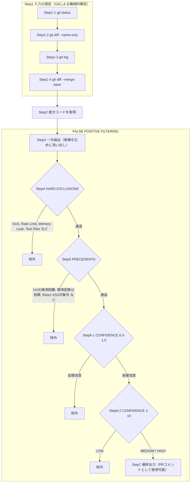
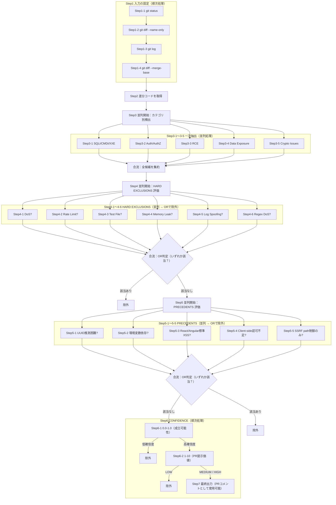

# /security-review は「厳しすぎる」くらいでちょうどいい：LLMセキュリティレビュー設計の奥行き

Anthropic が公開した `/security-review` は、Claude Code 向けのセキュリティレビューコマンドだ。  
ただし本質は「脆弱性をたくさん見つける機能」ではなく、**PR運用に耐える出力へ“収束”させるための制約設計**にある。

この記事は、**シンプル版 → 詳細版**の順で、どちらも

1) **表（処理の一覧）** → 2) **フローチャート** → 3) **処理の説明**

という3段で理解できるように構成している。

---

# シンプル版（表 → フローチャート → 説明）

## シンプル版：処理一覧（Step表）

| Step | 何をするか | 目的（何を防ぐか） |
|---|---|---|
| Step1-1 | git status | 実行環境の取り違いを防ぐ |
| Step1-2 | git diff --name-only | レビュー対象ファイルのスコープを固定する |
| Step1-3 | git log | 差分の背景（コミット範囲）を固定する |
| Step1-4 | git diff --merge-base | レビュー対象の差分本文を固定する |
| Step2 | 差分コードを取得 | 入力を「差分」のみに限定してスコープクリープを防ぐ |
| Step3 | 一次抽出（広めに候補を拾う） | 見落としを減らす（誤検知は後段で殺す） |
| Step4 | HARD EXCLUSIONS | コード差分だけで判断しにくい領域を無条件で除外しノイズを減らす |
| Step5 | PRECEDENTS | 現場の前例（暗黙知）で除外し、文脈のない指摘を抑える |
| Step6-1 | CONFIDENCE 第1段階（0.0–1.0） | 理論上のみ成立する指摘を落とす |
| Step6-2 | CONFIDENCE 第2段階（1–10） | PRレビューとして提示価値の低い指摘を落とす |
| Step7 | 最終出力（MEDIUM/HIGHのみ） | PRコメントとしてそのまま使える形に収束させる |

## シンプル版：フローチャート（Step番号付き）

## シンプル版：処理の説明（Step参照）

### Step1（Step1-1〜1-4）入力の固定
最初に Git コマンドで「差分」を機械的に確定する。  
**LLMにスコープ（どこまで読むか）を決めさせない**のが狙い。

### Step2 差分コードを取得
以降の全工程は、この差分本文だけを入力として扱う。  
既存コードや依存関係まで勝手に対象を広げない（スコープクリープ防止）。

### Step3 一次抽出（広く拾う）
“見落とさない”を優先し、セキュリティ上怪しい候補を広めに列挙する。  
誤検知は後段で落とす前提なので、ここは広くてよい。

### Step4 HARD EXCLUSIONS
コード差分だけでは妥当性判断が難しい領域（例：DoS、レート制限等）を最初から対象外にする。  
ここで重要なのは **「判断して除外」ではなく「領域ごと無条件除外」**にしている点。

### Step5 PRECEDENTS
現場の前例（暗黙知）をルールとして埋め込み、文脈がないLLMのノイズを抑える。  
（例：UUIDは推測困難として扱う、環境変数は信頼値として扱う、など）

### Step6-1 / Step6-2 CONFIDENCE（二段階評価）
1回で結論を出させず、**成立可能性 → PR提示価値**の順で二段階評価して LOW を落とす。

### Step7 最終出力
PRコメントとして使える粒度（MEDIUM/HIGH）に絞って出力する。  
「かもしれない」の羅列を避けるための収束点。

---

# 詳細版（表 → フローチャート → 説明）

## 詳細版：処理一覧（Step表）

詳細版では、Step3/4/5 を **並列（枝番）**として明示する。  
※「合流（JOIN）」は **Step番号を付けない**（図中のラベルとしてのみ表す）。

| Step | 何をするか | 備考 |
|---|---|---|
| Step1-1〜1-4 | 入力の固定 | シンプル版と同じ |
| Step2 | 差分コードを取得 | シンプル版と同じ |
| Step3 | 並列開始：カテゴリ別検出 | 枝（Step3-1〜3-5）が並列 |
| Step3-1 | SQLi/CMDi/XXE 検出 | 並列 |
| Step3-2 | Auth/AuthZ 検出 | 並列 |
| Step3-3 | RCE 検出 | 並列 |
| Step3-4 | Data Exposure 検出 | 並列 |
| Step3-5 | Crypto Issues 検出 | 並列 |
| Step4 | 並列開始：除外ルール評価（HARD） | 枝（Step4-1〜4-6）が並列、ORで除外 |
| Step4-1〜4-6 | DoS/RateLimit/Test/... 判定 | いずれか該当で除外 |
| Step5 | 並列開始：前例ルール評価（PRECEDENTS） | 枝（Step5-1〜5-5）が並列、ORで除外 |
| Step5-1〜5-5 | UUID/ENV/ReactXSS/... 判定 | いずれか該当で除外 |
| Step6-1 | 確信度 第1段階（0.0–1.0） | 順次 |
| Step6-2 | 確信度 第2段階（1–10） | 順次 |
| Step7 | 最終出力 | シンプル版と同じ |

## 詳細版：フローチャート（並行処理考慮・Step番号付き）

## 詳細版：処理の説明（Step参照）

### Step3（Step3-1〜3-5）一次抽出は「並列」が相性が良い
カテゴリごとの検出は独立して実行できるため並列化しやすい。  
ここでの目的は「広く拾う」ことなので、誤検知が混ざってよい。

### Step4（Step4-1〜4-6）HARD EXCLUSIONS は OR除外で“即死”させる
複数の除外条件を並列評価し、**どれか1つでも該当したら除外**する。  
「DoSかどうかをLLMに判断させる」ではなく、「DoS領域は無条件除外」にして一貫性を保つ。

### Step5（Step5-1〜5-5）PRECEDENTS も OR除外で“現場常識”を固定する
暗黙知をルール化し、文脈のないLLMの「理論上あり得る」指摘を抑える。  
ここも複数ルールを並列評価し、該当したら除外に寄せると安定する。

### Step6（Step6-1 → Step6-2）CONFIDENCE は順序が大事
二段階評価は **順次**であることに意味がある。  
成立可能性（Step6-1）で低いものを落としてから、PR提示価値（Step6-2）を判断する。

### 並列化の落とし穴（運用上の注意）
- 並列の結果をそのまま出すと順序が揺れる → 集約時に **安定した並び順**（例：ファイル→行番号→カテゴリ）を作る  
- 除外理由が追えないと揉める → 「Step4/Step5のどの枝で落ちたか」を内部ログに残す  
- Step3を絞りすぎると見落としが増える → **拾う（Step3）→削る（Step4/5/6）**の順序を崩さない

---

# 自チームに合わせるカスタム指針（変えてよい所／不変の所）

- **変えてよい**
  - Step4 / Step5 のルール（EXCLUSIONS / PRECEDENTS）：自社スタック・運用に合わせる
  - Step3 のカテゴリ優先順位：実害や組織の関心に合わせる
  - Step7 の出力テンプレ：レビュー文化に合わせる

- **不変にすべき（ここを壊すと“運用できる”が崩れる）**
  - 差分前提（Step1〜Step2 で入力固定）
  - 広く拾って狭く絞る（Step3 → Step4/5/6）
  - 低確信度（LOW）をそのままPRに出さない（Step6 → Step7）

---

# まとめ：/security-review は「制約設計」のリファレンス実装

`/security-review` の強みは「何を見つけるか」より **「何を見ないか」「何を言わないか」**を先に決めている点にある。  
LLMの性能が上がっても、スコープ・役割・出力の制約が曖昧だと、運用上は破綻しやすい。

だからこそ、`/security-review` は単なるセキュリティツールではなく、**LLMを実務に載せるための設計思想（制約設計）の参考実装**になっている。

---

**参考リンク**

- [anthropics/claude-code-security-review（GitHub）](https://github.com/anthropics/claude-code-security-review)
- [Automate security reviews with Claude Code（Anthropic公式ブログ）](https://www.anthropic.com/news/automate-security-reviews-with-claude-code)
- [Automated Security Reviews in Claude Code（Claude Help Center）](https://support.claude.com/en/articles/11932705-automated-security-reviews-in-claude-code)
