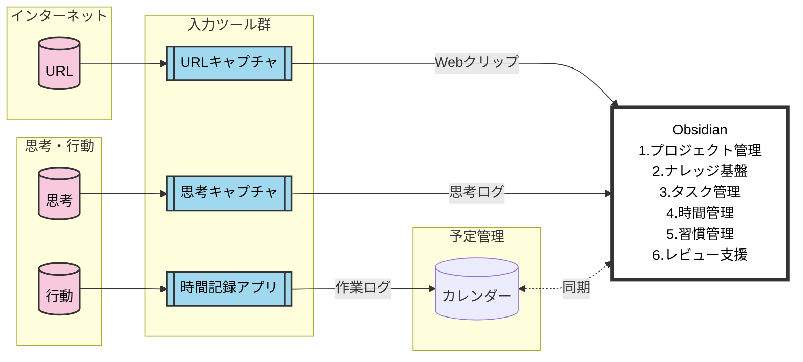

## 1. イントロダクション
Obsidianは「第2の脳（Second Brain）」を実現する強力なツールですが、その圧倒的な自由度の高さゆえに、「どう構成するか」で悩み、運用が破綻してしまうケースが後を絶ちません。
私も、独自のフォルダ構成やタグ運用を何度も試行錯誤しましたが、最終的にたどり着いた結論は、**「既存の優れたフレームワークや原則を徹底的に取り込み、自己流を排除すること」** でした。

本記事では、私がこの1年の試行錯誤の結果構築されたシステムの全体像を示しつつ、運用を安定させるために採用した重要な設計原則を紹介します。

## 2. 全体像
思考、行動、そしてWeb情報を一つの場所に集約し、有機的に連携させるシステムです。
予定はカレンダーに切り出しますが、それ以外の情報をObsidian内で管理します。

## 3. なぜ「既存フレームワーク」なのか
### 独自ルールの限界
- フォルダ構成を一から考えると、分類基準が揺れやすく、格納場所に迷う時間が増える。
- 独自のタグ付けルールは、記憶に依存するため長続きしない。

### 巨人の肩に乗る
先人たちが体系化した知識管理の手法を取り入れることで、**「迷う時間」をゼロにし、「考える時間」にリソースを集中**させます。
- **Zettelkasten（ツェッテルカステン）**
  知識を相互にリンクさせ、新たなアイデアを生み出す手法。
- **PARAメソッド**
  ティアゴ・フォルテ氏提唱。情報を「Actionability（行動可能性）」で分類する（Projects, Areas, Resources, Archives）。
- **CODEメソッド**
  Capture（収集）→ Organize（整理）→ Distill（抽出）→ Express（表現）という創造的プロセスの流れ。

:::message
Zettelkasten、PARAおよびCODEの詳細は、以下を参照してください。
* [TAKE NOTES!――メモで、あなただけのアウトプットが自然にできるようになる](https://www.amazon.co.jp/dp/4296000411)
* [SECOND BRAIN（セカンドブレイン） 時間に追われない「知的生産術」](https://www.amazon.co.jp/dp/4492558217)
:::

## 4. 運用を安定させる10の原則
本システムを支える中心的な設計思想です。Obsidianの自由度を活かして独自設計するのも一つの道ですが、これらの原則を取り入れることで「どう整理すべきか」の判断コストを下げ、より早く本来の目的（知識の活用）に集中できます。

### 🏷️ 構造化とルール
1.  **フォルダ構成は「PARAメソッド」に準拠する**
    - 独自フォルダを作らず、`Projects`, `Areas`, `Resources`, `Archives` の4つで管理します。
    - 日々の記録は `Periodic Notes`（周期ノート）を使用し、日次から年次まで階層構造で時系列管理します。
2.  **タグには「フォルダ名」のみを使用する**
    - 無秩序なタグ付けを禁止し、**PARAメソッドで作成したフォルダ名と一致する名称**のみをタグとして使用します。
    - **「フォルダがあるならタグは不要では？」という疑問に対する答え**
        - フォルダは「成果物の格納場所」ですが、思考や作業ログは時系列の「周期ノート（Dailyなど）」に発生します。
        - **タグは、この「時系列（Periodic Notes）」と「構造（PARA）」を紐づける接着剤として機能します。**
        - 例：`Projects/ブログ執筆` というフォルダがある場合、Daily Noteに思いついたアイデアを書き留める際に `#Projects/ブログ執筆` とタグ付けします。これにより、フォルダを移動することなく、あらゆる日付のノートからプロジェクト関連情報を一瞬で抽出（Dataview等で集約）可能になります。
3.  **フロントマターは `tags` と `aliases` のみ使う**
    - メタデータはシンプルに保ち、メンテナンスコストを最小限に抑えます。
4.  **コミュニティプラグインは最小限の導入とする**
    - 機能過多は複雑さを招きます。標準機能とコアプラグインを基本とし、どうしても必要なものだけを厳選します。

### 📝 ナレッジとプロセスの同期
5.  **インデックスノートは、CODEプロセスと同期して進行する**
    - インデックスノート（MOC）を静的な目次にするのではなく、プロジェクトの進捗（計画→収集→整理→アウトプット）に合わせて動的に書き換えていく運用にします。
6.  **タグ（フロントマター/インライン）の使い分けは、この仕様に準拠する**
    - ファイルの役割（全体管理用か、素材用か）に応じて、タグを付与する場所（ヘッダか、文中か）を明確に区別します。

### ✅ タスク・時間管理の「引き算」
7.  **作業時間は、重要プロジェクトのみを管理対象とし、すべての時間を追跡しない**
    - 24時間の記録は続きません。本当に成果を出したいプロジェクトだけにフォーカスして時間を計測します。
8.  **タスクはタグ・優先度・期日の3点に着目し管理する**
    - 複雑なパラメータを排除し、この3点の属性を重要視してタスクをコントロールします。

### 🔄 習慣・レビューの「本質」
9.  **習慣は、達成ではなく「記録」をゴールとする**
    - 「できなかった」という失敗体験は継続を阻害します。「やった・やらないを記録した」こと自体を成功とみなし、継続率を高めます。
10. **レビューは、計測可能な指標を用いて、階層的に実施する**
    - 「頑張った」という主観を排し、数値化できる実績のみで淡々と振り返ります。日次から年次まで階層構造を持たせます。

## 5. 次のステップへ
今回は、Obsidianを用いたナレッジ基盤構築の「設計思想」と「原則」についてお話ししました。
各原則の具体的な説明や、ツールの設定方法、実際の画面などは、後続の記事で順次解説していく予定です。
更新を見逃さないよう、ぜひフォローをお願いします。
